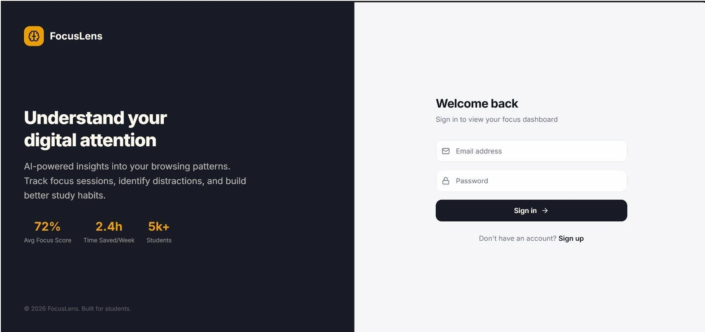
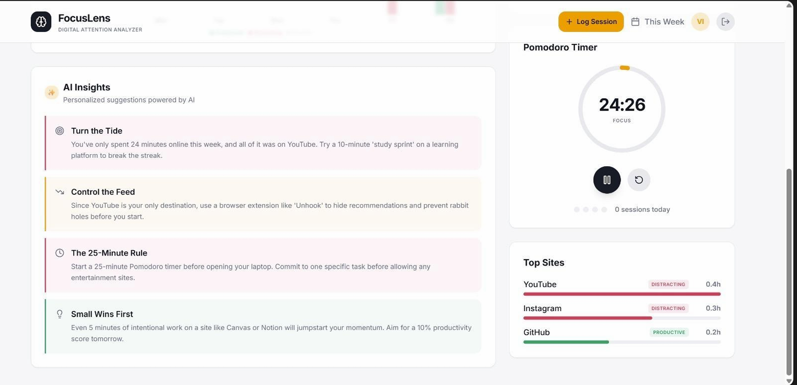
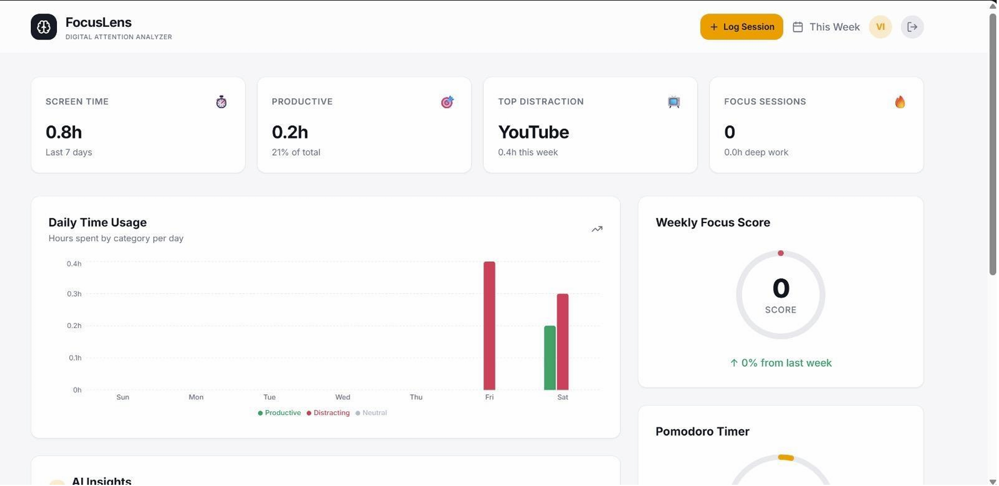

# AI-Based Digital Attention Analyzer for College Students

## Overview

The AI-Based Digital Attention Analyzer is a full-stack web application designed to help students monitor, analyze, and improve their focus during study sessions.

In today's digital environment, students frequently face distractions from social media, streaming platforms, and other non-academic websites. This project provides a data-driven solution by tracking browsing activity (with user consent), generating focus scores, and delivering AI-powered productivity insights.

---

## Problem Statement

Students lack visibility into their attention patterns during study time. While existing tools track screen time, they fail to provide:

- Student-specific insights
- AI-driven recommendations
- Real-time analytics in a web-based dashboard

This project bridges that gap by combining tracking, analytics, and AI suggestions in a unified platform.

---

## Key Features

- Real-time Browsing Tracking (via Chrome Extension)
- Focus Score Calculation
- AI-Based Productivity Suggestions
- Interactive Dashboard with Data Visualization
- Weekly Reports & Trend Analysis
- Pomodoro Timer Integration
- Secure Authentication System

---

## Tech Stack

### Frontend
- React.js
- Tailwind CSS
- Recharts (Data Visualization)

### Backend
- Node.js
- Express.js

### Database
- MongoDB Atlas

### Extension
- Chrome Extension API

### AI/ML
- OpenAI API / TensorFlow.js

---

## System Architecture

1. Chrome Extension captures browsing data
2. Data sent to backend API
3. Backend categorizes websites
4. Focus score is computed
5. AI generates personalized suggestions
6. Dashboard visualizes analytics

---

## Project Structure
/client → React frontend
/server → Node.js backend
/extension → Chrome extension
/models → Database schemas
/routes → API routes
/utils → Helper functions

---

## Implemented Features (Progress-1)

- Landing Page (Responsive UI)
- User Authentication (JWT-based)
- Dashboard UI with charts
- REST API for analytics
- Basic Chrome Extension (in progress)

---

## API Endpoints

### Auth
- POST `/api/auth/register`
- POST `/api/auth/login`

### Browsing Data
- POST `/api/browsing/log`

### Analytics
- GET `/api/analytics/daily`
- GET `/api/analytics/score`

---

## Installation & Setup

### Prerequisites
- Node.js
- MongoDB Atlas account
- Chrome Browser

## Output Screenshots

### 1. Landing Page

*Responsive landing page showcasing the project overview and key features.*

---

### 2. Dashboard Analytics

*Interactive dashboard displaying focus scores, browsing statistics, and productivity trends.*

---

### 3. AI Productivity Insights

*AI-generated recommendations and study improvement suggestions based on user activity.*
